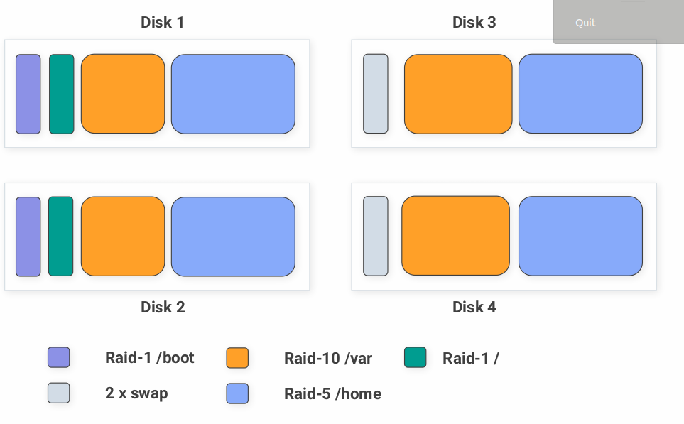

# Boot

1. Попасть в систему без пароля несколькими способами
2. Установить систему с LVM, после чего переименовать VG
3. Добавить модуль в initrd

## 1. Попасть в систему без пароля несколькими способами
### 1 способ init=/bin/sh

изменяем параметры загрузки контекстного меню выбора загрузки ядра в GUI
- удаляем параметр загрузки ядра `console=ttyS0,115200n8`
- добавляем параметры `selinux=0 init=/bin/sh`

### 2 способ rd.break

изменяем параметры загрузки контекстного меню выбора загрузки ядра в GUI

- удаляем параметр загрузки ядра console=ttyS0,115200n8
- добавляем параметры selinux=0 rd.break
- после загрузки систему можно изменить пароль администратора
- mount -o remount,rw /sysroot
- chroot /sysroot
- passwd root вводим пассворд с подтверждением
- exit, exit

### 3 способ rw init=/sysroot/bin/sh

изменяем параметры загрузки контекстного меню выбора загрузки ядра в GUI

- удаляем параметр загрузки ядра console=ttyS0,115200n8
- добавляем параметры selinux=0 init=/sysroot/bin/sh
- изменяем ro на rw

## 2. Установить систему с LVM, после чего переименовать VG
Установить систему с LVM и переименовать VG

- Проверяем состояние системы командой vgs
```
VG #PV #LV #SN Attr VSize VFree
VolGroup00 1 2 0 wz--n- <38.97g 0
```

- переименовываем VolGroup

`vgrename VolGroup00 OtusRoot`

- далее меняем значения в файлах `/etc/fstab` `/etc/default/grub` `/boot/grub2/grub.cfg`
- выполняем

`mkinitrd -f -v /boot/initramfs-$(uname -r).img $(uname -r)`
- перезагружаемся и проверяем vgs
```
VG #PV #LV #SN Attr VSize VFree
OtusRoot 1 2 0 wz--n- <38.97g 0
```

## 3. Добавить модуль в initrd
- создаем папку `/usr/lib/dracut/modules.d/01test` с файлами `test.sh` и `modules-setup.sh`
- `chmod +x /usr/lib/dracut/modules.d/01test/*`
- Пересобираем образ initrd
- `dracut -f -v`
- редактируем grub.cfg, удаляем параметры загрузки rghb и quiet
- после перезагрузки увидим отображение пингвина в терминале.

## 4. Сконфигурировать систему без отдельного раздела с /boot, а только с LVM
Репозиторий с пропатченым grub: https://yum.rumyantsev.com/centos/7/x86_64/
PV необходимо инициализировать с параметром --bootloaderareasize 1m 

## 5. Создать работающую систему с LVM поверх RAID
