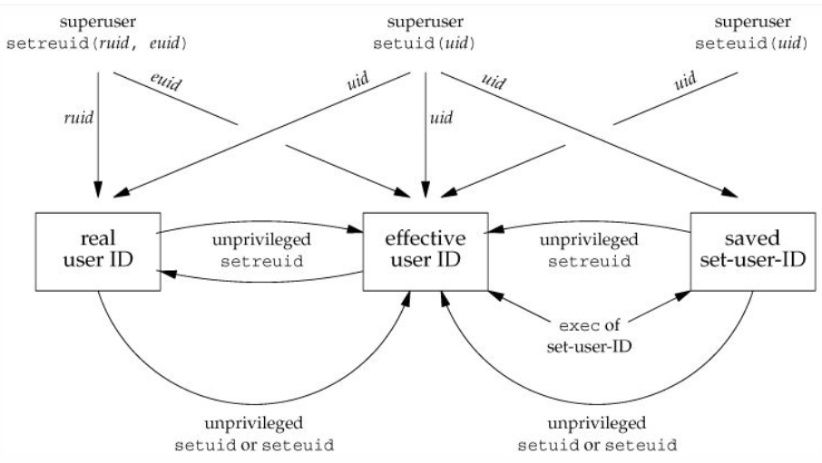

# 01. Kernel
### Utilites & man pages
- man 2 fstat
- mmap
- mprotect

- [Ядро и функции](https://pustovoi.ru/2010/1033)
---
# 02. Disk, RAID
- [Grub 2 supports Linux mdraid volumes natively.](https://unix.stackexchange.com/questions/17481/grub2-raid-boot)
- part-type важен только для MBR разделов. В GPT всегда primary
- [перенос дескрипторов рабочих процесов](https://www.redpill-linpro.com/sysadvent/2015/12/04/changing-a-process-file-descriptor-with-gdb.html)
- [inodes](https://pustovoi.ru/2019/3053)
---
# 03. LVM, FS, Storage

- Copy on write snapshot
- Thin provisioning
- LVM stripes
- device mapper
- Почиттаь про LVM Snapshot
- overbooking
- CLVM
- HA-LVM
- tmpfs. ramfs. rootfs. initramfs

- [x] где хранятся inodes? Каков их размер?
- [x] где устанавливается кол-во inodes
- reserved block count - зарезервированные 5% блоков диска. Изменяемо

### Utilites & man pages
dumpe2fs, lsblk, blkid, pdflush, man hier, man fsync, man 2 sync, tune2fs, stat, ncdu, lsof, fuser, fsck, mkfs, mount, blockdev, debugfs, xfs_info, mount, ls -i, find, hdparm, smartctl, lvcreate(8), lvconvert(8), lvchange(8), dm_multipath, multipathd,  dm_crypt,  cryptsetup(8), dmsetup, lslocks

- [LVM Cache](http://man7.org/linux/man-pages/man7/lvmcache.7.html)
- [sysfs](http://man7.org/linux/man-pages/man5/sysfs.5.html#NOTES)
- [inodes](https://pustovoi.ru/2019/3053)
- [LVM Snapshot & Virtualization](https://www.ibm.com/developerworks/ru/library/l-lvm2/)
- [RedHat LVM Administrator Guide](https://access.redhat.com/documentation/en-us/red_hat_enterprise_linux/6/html/logical_volume_manager_administration/index) [RU](https://access.redhat.com/documentation/ru-ru/red_hat_enterprise_linux/5/html/cluster_suite_overview/s1-clvm-overview-cso)
- [как используется дисковое пространство в Linux](https://habr.com/ru/company/flant/blog/354802/)

В современных системах имеет смысл выделять при установке:
/     - 8G
/home - 8G
/var  - 16G

Для приложений стоит выделять отдельные тома (например для mysql - отдельный том в /var/lib/mysql)


- [block. superblock. inode. hardlink.](https://unix.stackexchange.com/questions/4402/what-is-a-superblock-inode-dentry-and-a-file). 
Block - единица измерения данных на блочном устройстве. Диск оперирует блоками. Файл любого размера не может занимать меньше одного блока.
Superblock - информация о ФС:
- размер ФС
- размер блока
- битмап занятых блоков
- расположение и размер групп блоков и таблиц inode
- Суперблок находится в 1024 байтах от начала раздела
- несколько копий суперблока разбросаны по диску

Inode (индексный дескриптор) - информация о файле:
- размер файла в байтах
- идентификатор владельца файла
- идентификатор группы-владельца файла
- режим доступа к файлу, определяющий кто и какой доступ имеет к файлу
- дополнительные системные и пользовательские флаги, которые дополнительно могут ограничивать доступ к файлу и его модификацию
- временные метки, отражающие время модификации индексного дескриптора (ctime, changing time), время модификации содержимого файла (mtime, modification time) и время последнего доступа к файлу (atime, access time)
- счётчик для учёта количества жёстких ссылок на файл
- указатели на физические блоки диска, в которых хранится содержимое файла
- "Inode - это "вещи", на которые указывают записи каталога. Когда вы создаёте жёсткую ссылку на существующий файл, вы создаёте новый элемент директории, но не создаёте новый inode." (UNIX and Linux System Administration Handbook)
- [Индексные дескрипторы объединены в таблицу, которая содержится в начале каждой группы блоков](https://ru.wikipedia.org/wiki/Ext2#%D0%A1%D1%82%D1%80%D1%83%D0%BA%D1%82%D1%83%D1%80%D0%B0_%D0%B4%D0%B8%D1%81%D0%BA%D0%BE%D0%B2%D0%BE%D0%B3%D0%BE_%D1%80%D0%B0%D0%B7%D0%B4%D0%B5%D0%BB%D0%B0). [Обычно при создании файловой системы примерно 1 % её объёма выделяется под индексные дескрипторы](https://ru.wikipedia.org/wiki/Inode#%D0%9F%D0%BE%D0%B4%D1%80%D0%BE%D0%B1%D0%BD%D0%BE%D1%81%D1%82%D0%B8) . Все айноды хранятся в одной фиксированной таблице. Аллоцируются при создании ФС (новые ФС умеют динамически создавать)

## FS
- ext2 - standard
- ext3 = ext2 + journaling
- ext4 - increases few size limits, increases performance + extents (несколько блоков)

ФС кэширует дисковые блоки. Любые блоки могут кэшироваться, включая суперблоки, блоки с айнодами. sync записывает кэш в нужные блоки диска

### SSD
Состоит из ячеек флеш памяти, каждая из которых гораздо медленнее HDD, но благодаря параллельности работает быстрее. Страница (4 KiB) может быть перезаписана ограниченное количество раз. Поэтому прошивка распределяет запись между всеми страницами. Похоже на virtual memory

Страницы должны быть стерты перед записью. Стирание - гораздо более медленная опрерация, чем запись. Отдельные страницы не стираются - только кластеры из смежных страниц (обычно 128 страниц или 512 KiB)


---
# 04. Boot, BIOS, GRUB

/proc/cmdline - строка запуска ядра, конфигурация

### Utilites & man pages
bootparam, mkinitrd

- [initrd](https://en.wikipedia.org/wiki/Initial_ramdisk)


---
# 05. SystemD

/sbin/init
fork, setsid
В основе systemd лежит cgroups
Systemd-nspawn


### Utilites & man pages
- telinit
- systemd-analyze time, systemd-analyze blame
- man systemd-system.conf
- ulimit
- [setrlimit](http://man7.org/linux/man-pages/man2/setrlimit.2.html)
- [mount](https://www.freedesktop.org/software/systemd/man/systemd.mount.html)
- [timer](https://www.freedesktop.org/software/systemd/man/systemd.timer.html)
- machinectl
- [systemd docs](http://0pointer.de/blog/projects/systemd-docs.html)
- [systemd для системного администратора](https://mega.nz/#F!OdFEnYAK!dpUB6_qA_iKD1yTUa9S1_g?KIsjzQaK)

---
# 06. BASH, AWK

test
set -x - debug mode
exec

### Utilites & man pages
- [Advanced Bash-Scripting Guide](https://www.opennet.ru/docs/RUS/bash_scripting_guide/)
- [Язык обработки данных AWK](https://www.opennet.ru/docs/RUS/awk/)
- [sed](https://linuxconfig.org/learning-linux-commands-sed)
- [bash-скрипты на хабре](https://habr.com/en/company/ruvds/blog/325522/)
- [Bash Guide for Beginners](https://www.tldp.org/LDP/Bash-Beginners-Guide/html/)
- [Bash Cheatsheet](https://devhints.io/bash)


---
# 07. Package Management

### Utilites & man pages
- [GNU make](https://www.gnu.org/software/make/manual/make.html)
- [Mock](https://github.com/rpm-software-management/mock/wiki)
- [RPM Guide. RU](https://www.opennet.ru/docs/RUS/rpm_guide/)
- [Сборка RPM - быстрый старт](http://wiki.rosalab.ru/ru/index.php/%D0%A1%D0%B1%D0%BE%D1%80%D0%BA%D0%B0_RPM_-_%D0%B1%D1%8B%D1%81%D1%82%D1%80%D1%8B%D0%B9_%D1%81%D1%82%D0%B0%D1%80%D1%82)
- [RPM Packaging Guide](https://access.redhat.com/documentation/en-us/red_hat_enterprise_linux/7/html-single/rpm_packaging_guide/index)
- [Working with Source RPMs](https://blog.packagecloud.io/eng/2015/04/20/working-with-source-rpms/)
- [RPM Packaging Guide](https://rpm-packaging-guide.github.io/)


---
# 08. Processes
### Utilites & man pages
- renice
- ionice
- setuid, setgid
- ps
- smem
- fork, clone
- unshare, nsenter
- [Основы работы с сигналами](https://www.ibm.com/developerworks/ru/library/l-signals_1/index.html)
- [Linux process states with examples](https://idea.popcount.org/2012-12-11-linux-process-states/)
- [Updating ulimit on a running Linux process](https://www.gregchapple.com/blog/updating-ulimit-on-running-linux-process/)



```
[Forwarded from Протестировал]
Контейнерная и гипервизорная виртуализация сильно упростили создание тестовых стендов и уже трудно представить как мы обходились без этого раньше. Расстраивает, что из-за высокой популярности инструментов коллеги начинают переусложняют вещи, которые можно было бы сделать проще. Если процессу нужно ограничить доступ к файловой системе, то вполне можно обойтись chroot(8), если нужно изолировать сетевой стек или сделать ограничение по доступу к ресурсам системы, то обойтись unshare(1). Это не намного сложнее, чем использовать тот же docker или podman, но нужно один раз разобраться в том, из чего построены контейнеры.

Базовых механизмов всего четыре:

- namespaces (пространства имён) используются для группировки объектов ядра в различные наборы, к которым могут обращаться определенные деревья процессов. Звучит немного сложно, поэтому сразу пример - пространства имен PID ограничивают представление списка процессов процессами в пространстве имен. Всего есть несколько видов пространства имен, см. ниже.
- capability используются для более тонкой настройки полномочий для процесса. Если вы использовали опцию -cap-add для docker, то это оно.
- cgroups это механизм установки ограничений на доступ процесса к ресурсам системы (память, процессор).
- setrlimit - ещё один механизм для ограничения доступа к ресурсам системы наряду с cgroups. Он старее, чем cgroups, но может делать то, что cgroups не позволяют.
       
Пространства имён бывают следующими:

- mount namespace - монтирование и размонтирование ФС не будет иметь никакого эффекта на ФС самой системы.
- UTS namespace - установка имени машины (hostname) или доменного имени не будет иметь никакого эффекта для основной ОС.
- IPC namespace - процесс будет иметь независимые от основной ОС объекты IPC: очереди сообщений, семафоры и разделяемую память.
- network namespace - процесс сможет иметь независимые от основной ОС стеки протоколов IPv4 и IPv6, таблицы маршрутизации и др.
- PID namespace - процесс будет иметь отдельное представление дерева процессов.
- user namespace - процесс с таким пространством имён будет иметь отдельный набор UID, GID. Например суперпользователь в этом пространстве имён не будет иметь ничего общего с суперпользователем из основной ОС.

Чтобы понять лучше эти механизмы можно воспользоваться двумя утилитами: unshare и nsenter. Первая позволить из командной строки создавать пространства имен для отдельных процессов, а вторая подключаться к уже созданным пространствам имён.

Когда прийдёт понимание этих механизмов, то при необходимости использования контейнерной виртуализации вы сами себя будете спрашивать: "- Мне действительно нужно использовать docker с его абстракциями в тысячи строк кода или можно обойтись более простыми средствами?".

Прекрасной иллюстрацией к сказанному будет статья, в которой автор описывает тестирование сетевого сервера lldpd с использованием pytest и сетевых пространств имён - https://vincent.bernat.ch/en/blog/2016-testing-pytest-linux-namespaces.
```
---
# 09. Docker

---
# 10. Ansible
ansible-inventory --graph --vars

- [Динамическое инвентори в Ansible](https://medium.com/@Nklya/%D0%B4%D0%B8%D0%BD%D0%B0%D0%BC%D0%B8%D1%87%D0%B5%D1%81%D0%BA%D0%BE%D0%B5-%D0%B8%D0%BD%D0%B2%D0%B5%D0%BD%D1%82%D0%BE%D1%80%D0%B8-%D0%B2-ansible-9ee880d540d6)
- 

---
# 11 Namespaces, cgroups
- systemd-cgtop, systemd-cls
- chroot, jail, clone, setns, unshare, nsenter, /proc/<PID>/ns/, subuid, lsns, unshare, libcgroup-tools, cgget
- /etc/subuid, /etc/subgid
- atop, sar
- seccomp, captest, filecap, netcap, pscap
- [cgroups](https://habr.com/ru/company/redhatrussia/blog/423051/)
- [namespaces](https://www.polarsparc.com/xhtml/Containers-1.html), [part 2](https://www.polarsparc.com/xhtml/Containers-2.html)
- [Изолируем демоны с systemd](https://habr.com/ru/post/270165/)

### Controllers
- blkio: управление доступно полосой при доступе к блочным устройствам
- cpu: управление доступом к ресурсам процессора
- cpuacct: аккаунтинг cpu; используется совместно с контроллером cpu
- cpuset: выделение отдельных процессоров группе 
- devices: ограничение доступа к устройствам
- freezer: заморозка процессов (спасибо команде OpenVZ)
- memory: ограничение памяти для группы
- net_cls: шейпинг (man 8 tc)
- perf_event: интерфей сдля perf
- hugetlb: ограничение работы с huge pages
- pid: ограничение числа процессов

---
# 12. Performance
### Utilites & man pages
vmstat, pidstat, iostat, iotop, sar, top, atop
vmstat поле b - uninterruptable sleep - Если процессы в системе приостанавливаются из-за перегрузки памяти, то прирост нитей отражает именно значение в столбце b отчета vmstat, а не число нитей в очереди выполнения.(нить = поток?)[отсюда](https://www.ibm.com/support/knowledgecenter/ru/ssw_aix_72/performance/vmstat_command.html)
Кол-во процессов >500 на ядро - плохо. Много вермени уходит на переключение контекста

- Paging refers to writing portions, termed pages, of a process' memory to disk. Swapping, strictly speaking, refers to writing the entire process, not just part, to disk
- Page-Out - запись страницы на диск. Page-In - возврат с диска в физическую память
- Page fault - когда ядру нужна страница, но её нет в физической памяти. Требуется выполнить Page-In
- thrashing - постоянный page-in - page-out
- Huge Page - большие страницы (больше 4 кБ)
- [Page Cache](https://www.thomas-krenn.com/en/wiki/Linux_Page_Cache_Basics) - файлы с HDD, хранящиеся в RAM для бстрого доступа к ним. Поле Cache в выводе команды  free
- Dirty Pages - страницы в Page Cache, которые ещё не были записаны на диск. После вызова sync пишутся на диск
- [strace в Linux](https://habr.com/ru/company/badoo/blog/493856/)

---
# 14. AAA
### Utilites & man pages
useradd, passwd, usermod, userdel, groupadd, groupdel, groupmod, groups, id, newgrp, gpasswd, chgrp, chown, chmod

- SUID, SGID
- sticky bit - Каталог с установленным sticky-битом означает, что удалить файл из этого каталога может только владелец файла или суперпользователь
- umask - вычитаемая маска для определения прав файлов и каталогов при создании:
  - полная маска для каталога 777
  - umask -  022
  - созданный каталог с правами 755
- capabilities: getcap, setcap, capsh
- PolKit: pkaction, pkcheck, pkexec, pkttyagent
- ACL: setfacl, 
- PAM: ldd /bin/su | grep pam
- [Whai is PAM?](https://medium.com/information-and-technology/wtf-is-pam-99a16c80ac57)
- [Основы и настройка PAM](https://www.ibm.com/developerworks/ru/library/l-pam/index.html)
- [CAP_SYS_ADMIN: the new root](https://lwn.net/Articles/486306/)
- [OpenNET. Как работает PAM](https://www.opennet.ru/base/net/pam_linux.txt.html)
- [Linux Capabilities In Practice](https://blog.container-solutions.com/linux-capabilities-in-practice)
- AppArmor


---
# 15. SELinux
### Utilites & man pages
sesearch, seinfo, findcon, audit2allow, audit2why, chcon, restorecon, autorelabel, getsebool, setsebool
- [ SELinux/Tutorials/How does a process get into a certain context ](https://wiki.gentoo.org/wiki/SELinux/Tutorials/How_does_a_process_get_into_a_certain_context)


---
# 16. Backup
- [vagrant-bacula](https://github.com/haf/vagrant-bacula)
- [Linux rsync command](https://www.computerhope.com/unix/rsync.htm)
- [ Cкоростная синхронизация миллиарда файлов ](https://habr.com/en/post/132098/)
- [ Сравнение способов резервного копирования ](https://habr.com/en/company/selectel/blog/226831/)

---
# 17. Logs
- [ Аудит системных событий в Linux ](https://habr.com/en/company/selectel/blog/267833/)
- [ Kdump — диагностика и анализ причин сбоев ядра ](https://habr.com/en/company/selectel/blog/226487/)
- [Анализ падения ядра в Linux ](http://geckich.blogspot.com/2013/11/linux-kernel-crash-dump.html)
- [Аудит системных событий](https://xakep.ru/2011/03/30/54897/)
- [Удаленное логирование в journald или Всё ещё «это вам не нужно»?](https://habr.com/en/company/southbridge/blog/317182/)

### JournalD options
- journalctl --field=_TRANSPORT - все доступные транспорты
-  journalctl _TRANSPORT=syslog - то, что пришло через syslog
- journalctl _TRANSPORT=syslog -o verbose - структурированные данные
- journalctl -p crit
 -p
  emerg (0)
  alert (1) - PRIORITY=1
  crit (2) - PRIORITY=1
  err (3) - PRIORITY=3
  warning (4)
  notice (5)
  info (6)
  debug (7)
- journactl -u mysqld.service -f - отслеживание лога mysql (аналог tail -f)
- journalctl _UID=0 - все с UID 0
- journalctl --list-boots - показать время ребутов сервера (если нет директории то будет показан только последний)
- journalctl -b -2 - показать логи второго бута


---
# 18. Архитектура сетей


---
# Additional
nginx, resty, lua - сборка RPM - самое начало видео 11 части
[AWS](https://github.com/nickpoida/og-aws)


---
# vim
- [vi philosophy. Best abou vi!](https://stackoverflow.com/questions/1218390/what-is-your-most-productive-shortcut-with-vim)
- [intercative](https://vim-adventures.com/) [tutorials](https://www.openvim.com/)
u - undo
ctrl+r - redo
A/I (^$)- string start/end
w/W (b/B) - one word forward (backward)
gg - to first line
G - to last line
:30 - to line 30
ctrl+u/d - pgup/pgdn
z/zt - 
dd/d^/d$/dw - delete line, to linestart, to linednd, delete word
dt. - delete all before .
x - delete symbol under cursor
2yy - copy 2 lines
p/P - paste
s/что менять/на что менять - в строке
%s/что менять/на что менять - во всем файле
<</>> - сдвинуть строку

---
[Частые вопросы на собеседованиях:](https://docs.google.com/presentation/d/1KDDRYFesje2auTqvKv47JZmCY1mQ8S96ok7FF6geLL4/edit#slide=id.g43c1a38660_0_11)
[Ещё](https://github.com/trimstray/test-your-sysadmin-skills)
- работа тут [glassdoor](https://glassdoor.com/), [quora](https://www.quora.com/), [myvisajobs](http://myvisajobs.com/), [indeed](http://indeed.com/)
- как устраиваться [Цинизм в IT: Павел Одинцов, CloudFlare](https://www.stableit.ru/2016/09/blog-post_27.html?m=1)
LoadAvarage, Process Scheduling, IO Scheduling, Kernel Modules
File Systems: Deny root delete, Suid Bit, Journaling file system, COW
Network: TIME_WAIT, Shaped Ingress, Vlan, NAT, Bridge, Cluster Networking: K8, Swarm
- Процесс на С съел 100% CPU. Как узнать почему?
- Сервер писал в файл. Произошел kernel panic, данные стерлись. Почему? Как этого избежать?
- Что такое Page Cache? Coredump? CPU HW exception?
- Есть ли утечки памяти в языках с garbage collector?
- SIGKILL VS SIGINT
- Будет ли блокироваться запись в сетевой сокет если удаленный сервер ещё не принял данные?

---
# Performance Lab
Dmitry Bubnov, [16.04.20 09:21]
[Forwarded from Вадим Исаканов]
Глянь еще https://youtu.be/gXeaeOAIfvc

Dmitry Bubnov, [16.04.20 09:21]
[Forwarded from Вадим Исаканов]
Еще хорошая статья по докладу с Хайлоуд++
https://habr.com/ru/post/322562/
Только переписыванием софта (как тут мемкешед переписывали) тебе заниматься не нужно

Dmitry Bubnov, [16.04.20 09:21]
[Forwarded from Вадим Исаканов]
Но в целом - не представляю, как по 1-2 статьям научиться таким вещам
Нужно разобраться по очереди (в работе или хотя бы в лабе) с каждой из используемых софтин, а затем постепенно усложнять схему (сначала вебсерверы отмасштабировать, потом БД, потом кэши и т.п., на каждом этапе только одно усложнение).

Dmitry Bubnov, [16.04.20 10:35]
[Forwarded from Slach]
memcache принято менять на redis и на его мультитредовые аналоги ;)
а apache менять на nginx
пока проект мелкий, можно на одном сервере держать
потом придется переносить, через связку redis и репликацию master-slave (она не только в MySQL бывает, репликация ;)

если тебе хватает CPU и памяти, то можно держать на одном сервере, но сразу тренироваться переносить на другой без простоя... или с минимальным простоем

Dmitry Bubnov, [16.04.20 15:47]
[Forwarded from Matvey]
все наверное это знают, и много кто так делает, но все же напишу. Для постоянного изучения и опробации лучше иметь домашний стенд, такой недорого можно собрать на алиэкспресс. На базе китайской материнской платы типа Huanan. Там же к ней продаются серверные процы и память БУ, буквально за 30-35к(сейчас возможно даже дешевле) можно собрать неплохой стенд. К примеру я собрал на базе xeon 2680v2(10 ядер, 20 потоков)+64ГБ reg ecc+nvme накопитель(на него положил диски виртуалок). Для учебных стендов его "за глаза" хватает

--
Вадим Исаканов, [10.04.20 15:22]
можно тесты и гонять, думаю
тут сложности две, заодно две возможности прокачаться
- сделать тесты, которые правдоподобно эмулируют тысячи подключений в секунду, например, сложно, но можно
- ну и собсно оптимизацию отточить

Вадим Исаканов, [10.04.20 15:23]
Отдельная задача - придумать темы тестов
Можно пробовать построить копии реально работающих сервисов, и тестировать нагрузку на них

Вадим Исаканов, [10.04.20 15:27]
можно потрейсить любое приложение, которое достаточно быстро исполняется
пхп какойнибудь потрейсить, там достаточно понятно все

Вадим Исаканов, [10.04.20 15:33]
Еще есть анализ коредампов
Похоже на стрейс, но как "снимок памяти в момент проблемы"

