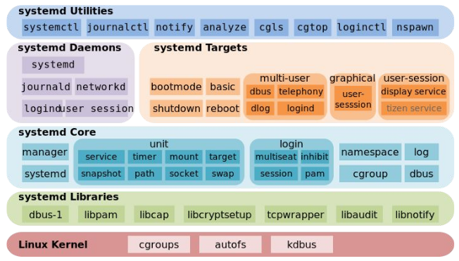

# 01. Kernel
### Utilites & man pages
- man 2 fstat
- mmap
- mprotect

- [Ядро и функции](https://pustovoi.ru/2010/1033)
---
# 02. Disk, RAID
- [Grub 2 supports Linux mdraid volumes natively.](https://unix.stackexchange.com/questions/17481/grub2-raid-boot)
- part-type важен только для MBR разделов. В GPT всегда primary
- [перенос дескрипторов рабочих процесов](https://www.redpill-linpro.com/sysadvent/2015/12/04/changing-a-process-file-descriptor-with-gdb.html)
- [inodes](https://pustovoi.ru/2019/3053)
---
# 03. LVM, FS, Storage

- Copy on write snapshot
- Thin provisioning
- LVM stripes
- device mapper
- Почиттаь про LVM Snapshot
- overbooking
- CLVM
- HA-LVM
- tmpfs. ramfs. rootfs. initramfs

- [x] где хранятся inodes? Каков их размер?
- [x] где устанавливается кол-во inodes
- reserved block count - зарезервированные 5% блоков диска. Изменяемо

### Utilites & man pages
dumpe2fs, lsblk, blkid, pdflush, man hier, man fsync, man 2 sync, tune2fs, stat, ncdu, lsof, fuser, fsck, mkfs, mount, blockdev, debugfs, xfs_info, mount, ls -i, find, hdparm, smartctl, lvcreate(8), lvconvert(8), lvchange(8), dm_multipath, multipathd,  dm_crypt,  cryptsetup(8), dmsetup

- [LVM Cache](http://man7.org/linux/man-pages/man7/lvmcache.7.html)
- [sysfs](http://man7.org/linux/man-pages/man5/sysfs.5.html#NOTES)
- [inodes](https://pustovoi.ru/2019/3053)
- [LVM Snapshot & Virtualization](https://www.ibm.com/developerworks/ru/library/l-lvm2/)
- [RedHat LVM Administrator Guide](https://access.redhat.com/documentation/en-us/red_hat_enterprise_linux/6/html/logical_volume_manager_administration/index) [RU](https://access.redhat.com/documentation/ru-ru/red_hat_enterprise_linux/5/html/cluster_suite_overview/s1-clvm-overview-cso)
- [как используется дисковое пространство в Linux](https://habr.com/ru/company/flant/blog/354802/)

В современных системах имеет смысл выделять при установке:
/     - 8G
/home - 8G
/var  - 16G

Для приложений стоит выделять отдельные тома (например для mysql - отдельный том в /var/lib/mysql)

- [block. superblock. inode. hardlink.](https://unix.stackexchange.com/questions/4402/what-is-a-superblock-inode-dentry-and-a-file). 
Block - единица измерения данных на блочном устройстве. Диск оперирует блоками. Файл любого размера не может занимать меньше одного блока.
Superblock - информация о ФС:
- размер ФС
- размер блока
- битмап занятых блоков
- расположение и размер групп блоков и таблиц inode
- Суперблок находится в 1024 байтах от начала раздела
- несколько копий суперблока разбросаны по диску

Inode (индексный дескриптор) - информация о файле:
- размер файла в байтах
- идентификатор владельца файла
- идентификатор группы-владельца файла
- режим доступа к файлу, определяющий кто и какой доступ имеет к файлу
- дополнительные системные и пользовательские флаги, которые дополнительно могут ограничивать доступ к файлу и его модификацию
- временные метки, отражающие время модификации индексного дескриптора (ctime, changing time), время модификации содержимого файла (mtime, modification time) и время последнего доступа к файлу (atime, access time)
- счётчик для учёта количества жёстких ссылок на файл
- указатели на физические блоки диска, в которых хранится содержимое файла
- "Inode - это "вещи", на которые указывают записи каталога. Когда вы создаёте жёсткую ссылку на существующий файл, вы создаёте новый элемент директории, но не создаёте новый inode." (UNIX and Linux System Administration Handbook)
- [Индексные дескрипторы объединены в таблицу, которая содержится в начале каждой группы блоков](https://ru.wikipedia.org/wiki/Ext2#%D0%A1%D1%82%D1%80%D1%83%D0%BA%D1%82%D1%83%D1%80%D0%B0_%D0%B4%D0%B8%D1%81%D0%BA%D0%BE%D0%B2%D0%BE%D0%B3%D0%BE_%D1%80%D0%B0%D0%B7%D0%B4%D0%B5%D0%BB%D0%B0). [Обычно при создании файловой системы примерно 1 % её объёма выделяется под индексные дескрипторы](https://ru.wikipedia.org/wiki/Inode#%D0%9F%D0%BE%D0%B4%D1%80%D0%BE%D0%B1%D0%BD%D0%BE%D1%81%D1%82%D0%B8) . Все айноды хранятся в одной фиксированной таблице. Аллоцируются при создании ФС (новые ФС умеют динамически создавать)

## FS
- ext2 - standard
- ext3 = ext2 + journaling
- ext4 - increases few size limits, increases performance + extents (несколько блоков)

ФС кэширует дисковые блоки. Любые блоки могут кэшироваться, включая суперблоки, блоки с айнодами. sync записывает кэш в нужные блоки диска

### SSD
Состоит из ячеек флеш памяти, каждая из которых гораздо медленнее HDD, но благодаря параллельности работает быстрее. Страница (4 KiB) может быть перезаписана ограниченное количество раз. Поэтому прошивка распределяет запись между всеми страницами. Похоже на virtual memory

Страницы должны быть стерты перед записью. Стирание - гораздо более медленная опрерация, чем запись. Отдельные страницы не стираются - только кластеры из смежных страниц (обычно 128 страниц или 512 KiB)

---
# 04. Boot, BIOS, GRUB

/proc/cmdline - строка запуска ядра, конфигурация

### Utilites & man pages
bootparam, mkinitrd

- [initrd](https://en.wikipedia.org/wiki/Initial_ramdisk)

---
# 05. SystemD

/sbin/init
fork, setsid
В основе systemd лежит cgroups
Systemd-nspawn

### Utilites & man pages
- telinit
- systemd-analyze time, systemd-analyze blame
- man systemd-system.conf
- ulimit
- [setrlimit](http://man7.org/linux/man-pages/man2/setrlimit.2.html)
- [mount](https://www.freedesktop.org/software/systemd/man/systemd.mount.html)
- [timer](https://www.freedesktop.org/software/systemd/man/systemd.timer.html)
- machinectl
- [systemd docs](http://0pointer.de/blog/projects/systemd-docs.html)

---
[Частые вопросы на собеседованиях:](https://docs.google.com/presentation/d/1KDDRYFesje2auTqvKv47JZmCY1mQ8S96ok7FF6geLL4/edit#slide=id.g43c1a38660_0_11)
LoadAvarage, Process Scheduling, IO Scheduling, Kernel Modules
File Systems: Deny root delete, Suid Bit, Journaling file system, COW
Network: TIME_WAIT, Shaped Ingress, Vlan, NAT, Bridge, Cluster Networking: K8, Swarm

